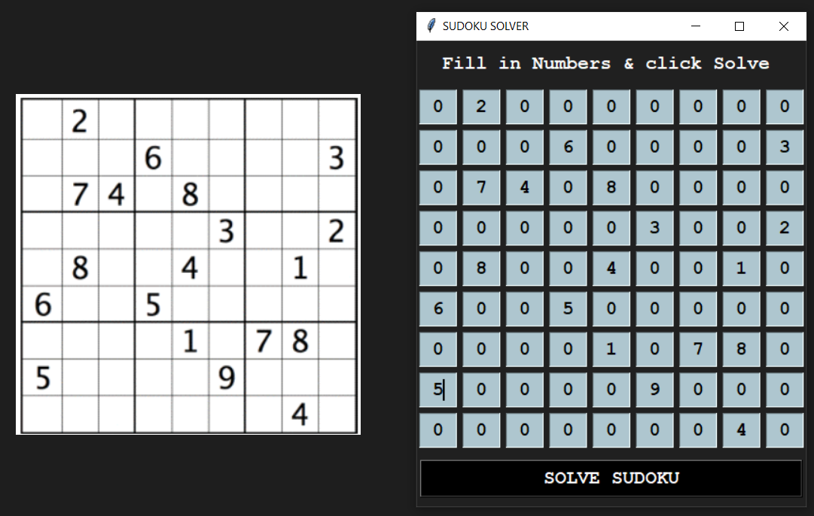
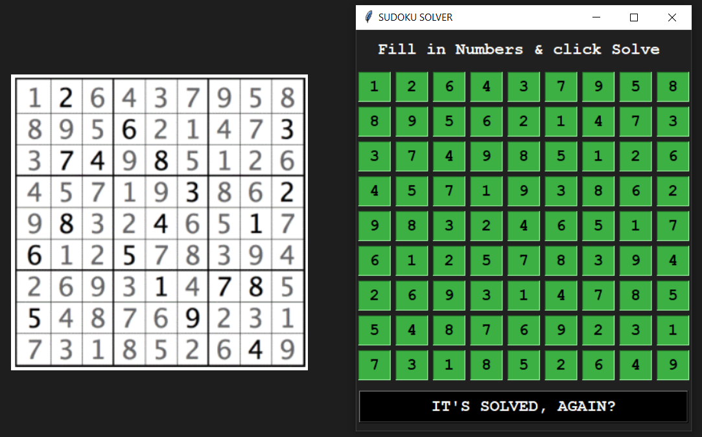

<html>
  

  <h1> SUDOKU SOLVER </h1>
  <h3> Just a Simple Sudoku Solver made as a Python Project for Btech Semester II </h3>
  

  

     
     
  

  

  <h3>Download the Code and Run it on your Machine to check it out!</h3>
  

</html>
